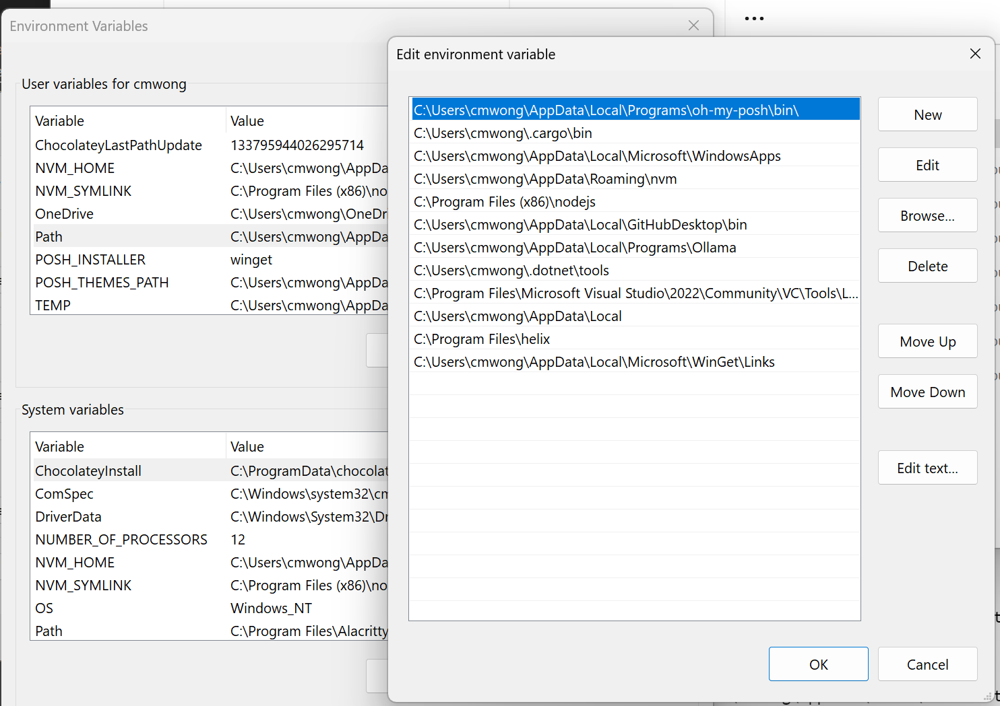

## PowerShell

[download powershell arm64 from microsoft](https://learn.microsoft.com/en-us/powershell/scripting/install/installing-powershell-on-windows?view=powershell-7.4#msi)

[Pretty Powershell](https://github.com/ChrisTitusTech/powershell-profile/blob/main/README.md)

[fzf](https://github.com/junegunn/fzf)
[ripgrep](https://github.com/BurntSushi/ripgrep)
[fd](https://github.com/sharkdp/fd)

After installing, missing rg, fzf and fd
In user PATH, with a 
C:\Users\cmwong\AppData\Local\Microsoft\WinGet\Links, and it has a zoxide.exe symbolic link
So, I decide to make rg, fzf and fd symbolic link to this WinGet\Links folder, C:\Users\cmwong\AppData\Local\Microsoft\WinGet\Links folder.



```bash
# make symbolic link
# cmd in administrator mode

# rg (ripgrep)
mklink C:\Users\cmwong\AppData\Local\Microsoft\WinGet\Links\rg.exe C:\Users\cmwong\AppData\Local\Microsoft\WinGet\Packages\BurntSushi.ripgrep.MSVC_Microsoft.Winget.Source_8wekyb3d8bbwe\ripgrep-14.1.1-x86_64-pc-windows-msvc\rg.exe

# fzf
mklink C:\Users\cmwong\AppData\Local\Microsoft\WinGet\Links\fzf.exe C:\Users\cmwong\AppData\Local\Microsoft\WinGet\Packages\junegunn.fzf_Microsoft.Winget.Source_8wekyb3d8bbwe\fzf.exe

# fd
mklink C:\Users\cmwong\AppData\Local\Microsoft\WinGet\Links\fd.exe C:\Users\cmwong\AppData\Local\Microsoft\WinGet\Packages\sharkdp.fd_Microsoft.Winget.Source_8wekyb3d8bbwe\fd-v10.2.0-x86_64-pc-windows-msvc\fd.exe

```

### Change Oh-my-posh Themes
[reference](https://ohmyposh.dev/docs/themes)
```bash
Get-PoshThemes
```
```bash
# C:\Users\cmwong\Documents\Powershell\profile.ps1
# put the following in profile.ps1
oh-my-posh init pwsh --config 'C:\Users\cmwong\AppData\Local\Programs\oh-my-posh\themes\kali.omp.json' | Invoke-Expression
```

### uninstall ripgrep from winget
```bash
winget uninstall BurntSushi.ripgrep.MSVC

# install with cargo
cargo install ripgrep
```